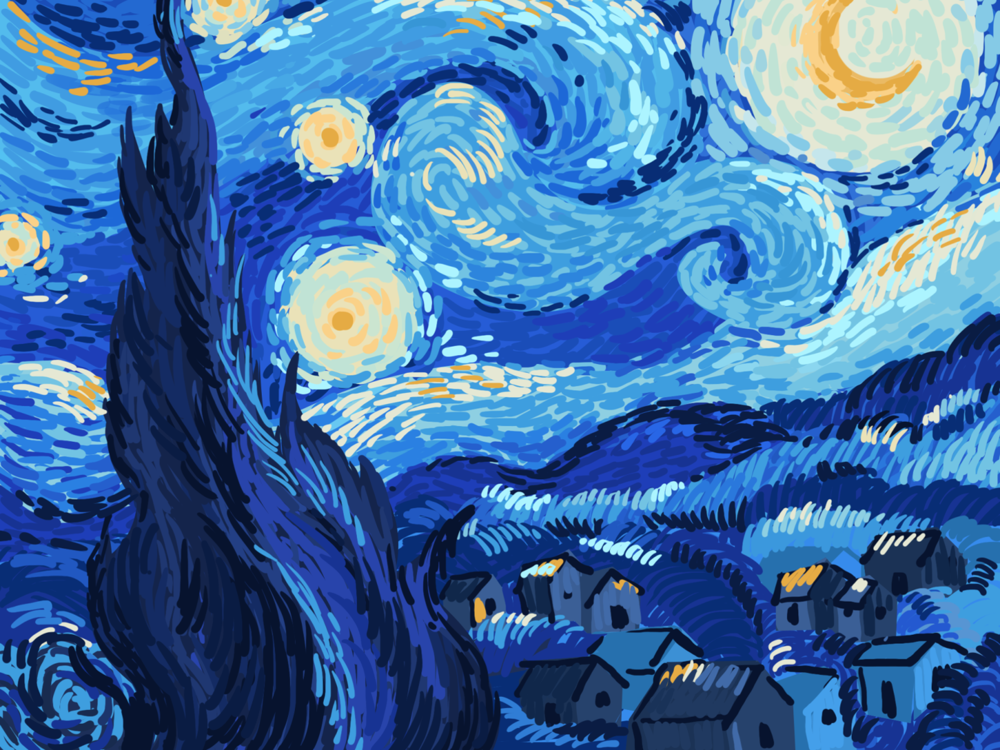

*本项目尚处于早期开发阶段，我们无法保证功能的可用性和连续性。*

# STARY NIGHT 星夜

> 星垂平野阔，月涌大江流。 —— 杜甫《旅夜书怀》

## 关于星夜

TBD

## 快速加入

- 访问 [新星](https://stary-night.com/new.html)，提交网站信息并等待，自动审核程序将每 30 分钟轮询一次并将通过审核的网站加入 [星图](https://stary-night.com/staratlas.html)。

- 随后将项目网址 `https://stary-night.com` 添加到您的网站导航栏、侧边栏等显眼的位置：

  - 中文标题可以使用 `星夜`，英文标题可以使用 `STARY NIGHT`。

  - 至于网站图标，Emoji 用户推荐使用 `✨`，Font Awesome 用户推荐使用 `fa-star`。

- 我们建议您启用站点地图功能，以便于我们将您的最新文章汇聚在 [今夜星辰](https://stary-night.com/tonight.html)。

## 加入条件

您的网站必须满足以下条件方可通过我们的自动审核程序：

- 网站的类型为 `博客`。

- 能够正常访问且全站启用 HTTPS。

- 无侵入式广告和影响阅读体验的内容。

### 人工审核

如果您无法通过我们的自动审核程序，请走 [人工审核](https://stary-night.com/review.html) 通道。`全体星夜成员` 都有资格参与审核投票，为期一周。
### 匿名举报

`全体星夜成员` 都有资格 [匿名举报](https://stary-night.com/report.html) 疑似违规的网站。与人工审核的流程相似，投票的结果将决定网站的去留。

## 常见问题

- **我该如何修改或更新我的网站信息？**  
  访问 [更新](https://stary-night.com/update.html) 页面可更改星夜成员的网站信息。请注意，您每天只有一次更改的机会。

- **我该如何退出星夜？**  
  访问 [退出](https://stary-night.com/quit.html) 页面即可立即退出星夜，我们将在 30 分钟轮询期后删除您的所有数据。

## 联系我们

如果您对我们的隐私政策或我们所持有的您的信息有任何疑问，请发邮件至 [lookup@stary-night.com](mailto:lookup@stary-night.com) 与我们联系。

## 许可协议

本项目灵感来源于 [travellings](https://github.com/volfclub/travellings) 和 [十年之约](https://www.foreverblog.cn/)，根据要求沿用 [MPL 2.0](https://www.mozilla.org/en-US/MPL/2.0/) 许可协议。